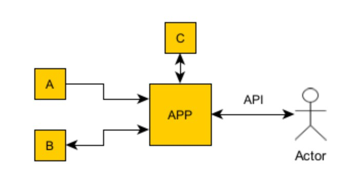
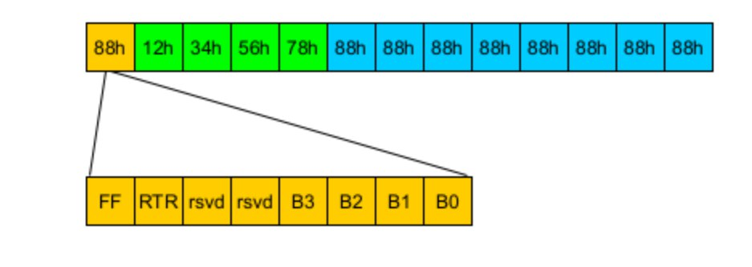

# CAN Frame Simulation Project

## Overview
This project simulates CAN (Controller Area Network) frame communication between devices over Ethernet/TCP. It includes device emulators, a cloud application for processing frames, and a web interface for monitoring and control.

## Project Structure
- `main.py` - Entry point for the application
- `can_frame.py` - CAN frame encoding/decoding utilities
- `device_emulator.py` - Simulates devices that generate CAN frames
- `module_c.py` - Performs calculations based on device data
- `cloud_app.py` - FastAPI application that manages communication
- `cloud_pipeline.py` - Processes CAN frames through a pipeline
- `websocket_handler.py` - Manages WebSocket connections
- `config.py` - Global configuration settings
- `static/` - Web interface files (HTML, CSS, JavaScript)

## Features
- Device A: Emulates a device that reports status
- Device B: Emulates a device that reports status and accepts control commands
- Module C: Performs calculations based on data from Devices A and B
- Cloud App: Manages communication between devices and web interface
- Web Interface: Provides monitoring and control capabilities

## Requirements
See `requirements.txt` for a complete list of dependencies.

Main dependencies:
- Python 3.9+
- FastAPI
- Uvicorn
- WebSockets

## Installation

```bash
# Create and activate a virtual environment
python -m venv venv
source venv/bin/activate  # On Windows: venv\Scripts\activate

# Install dependencies
pip install -r requirements.txt
```

## Running the Application

```bash
python main.py
```

The application will automatically open a web browser pointing to the local server (default: http://127.0.0.1:8000).

## Development

### Simulation Speed
You can adjust the simulation speed using the web interface or by modifying the `SCALE_TIMING` value in `config.py`.

### Adding New Devices
To add new device emulators:
1. Create a new class that inherits from `DeviceEmulator` in `device_emulator.py`
2. Implement the required methods
3. Update the `CloudApp` and `CloudPipeline` classes to handle the new device

### Logging
The application uses Python's built-in logging module. Logs are written to both the console and `simulation.log`.

## License
This project is proprietary and confidential.


# Motivation

This project is attempting to solve the "case" task described in the attached document located in the "doc" directory.

## Setup Instructions

To run the project, use a virtual environment (`venv`) and install the dependencies listed in the attached `requirements.txt` file.

Launch the application with the following command:

```bash
python main.py
```

In a web browser, open one of the following URLs:  
- `http://127.0.0.1:8000`  
- `http://127.0.0.1:8001`  
- `http://127.0.0.1:8002`  
...and so on.

The program automatically searches for an available port. If port `8000` is occupied, it will try `8001`, then `8002`, and continue incrementally.

Once opened in the browser, you will see control panels for the APP as described in the task.

## Summary of Control Panel Contents

### Device A
- Device A only sends the value of its internal register.  
- The register value changes 3 times per minute based on the current second within the minute:  
  - `1`: 0–20 seconds  
  - `2`: 21–40 seconds  
  - `3`: 41–60 seconds  

### Device B
- In addition to signaling the "Watchdog" status, Device B allows setting the value of its internal "Control Value" register.  
- This value is subsequently sent to Module C.

### Module C
- Displays two values received from Device A and Device B, along with the result of a simple example calculation.  
- The calculation is the sum of the values from A and B, multiplied by a time-dependent operational value.  
- The operational value is determined based on the current second:  
  ```plaintext
  Get operational value to multiply based on current second:
  1:    01–15 seconds
  10:   16–30 seconds
  100:  31–45 seconds
  1000: 46–00 seconds
  ```  
- This is an example operation designed to clearly demonstrate correctness.

### Watchdog Control
- Allows manual resetting of the watchdog or setting the frequency of automatic resets.

### Simulation Rate Control
- Enables adjustment of the simulation process speed for analysis or testing purposes.

## Simulation Algorithm
The simulation algorithm is based on the "APP in the cloud" or "Cloud App," which serves as the central node for all communication pipelines. Communication occurs via CANFrame gateways.

---


# The Task

## Problem Description



The system consists of two physical devices, A and B, connected to a WAN (Wide Area Network) via CAN-TCP gateways. These gateways provide a TCP server on the WAN side, which accepts and sends frames in a format described later in the document.

The application, referred to as APP, is hosted in the cloud and maintains communication with devices A and B through the gateways. This communication occurs in the form of short messages with a fixed structure (header, size, data) and variable content (CAN ID, values of individual fields). The frequency of frame transmission is constant for each device, depends on their configuration, and ranges from a few to a dozen frames per second. A single CAN-TCP gateway can handle up to 4 simultaneous TCP connections. Once a connection is established, the gateway server automatically begins transmitting frames received from the devices.

Device A can report its operational status but does not accept incoming data. Device B reports its status and accepts control commands (specified by a CAN ID with a parameter). The status of the devices is reported by transmitting several registers (assumed to be 16-bit for this task).

Device B is equipped with a watchdog mechanism, which requires reset messages to be received at least every 500 ms, independent of other communications. Resetting the watchdog involves writing a predefined value to one of its registers. Apart from this mechanism, Device B can also receive frames that set registers controlling its operation. This information is automatically relayed by the APP application based on an embedded control algorithm or additionally at the user’s request.

Block C is a replaceable component of the application that reacts to parameters transmitted by devices A and B. For the purposes of this task, it can be assumed that devices A and B transmit single parameters as numbers, and Block C performs a simple arithmetic operation on them, making the result available back to the application. Block C operates in a real-time system regime, and its implemented algorithm requires calculations to be performed every 100 ms. The result depends on the current time.

The application provides an external user interface in the form of an API, accessible via a web browser. The user can use the API to read information transmitted by devices A and B, as well as the results of calculations performed by Block C. The user can also set parameters to control the algorithm within the APP and the operation of Device B.

## Task Description

The task involves creating the following in Python:

- An APP application that provides an interface (e.g., using FastAPI) enabling:
  - Monitoring/displaying the status of devices A, B, and Block C.
  - Sending commands/configuring Device B and the APP algorithm.
- Emulators/stubs for devices A and B.

## Excerpt from CAN-TCP Gateway Documentation

**CAN Data Transfer to Ethernet Data:**  
CAN ID and data are transferred into a 13-byte format.



---

# CAN-TCP Gateway Data Transfer Specification

## Overview

This document describes the data format for CAN (Controller Area Network) to Ethernet conversion used by the CAN-TCP gateway. The gateway transfers CAN frame information over Ethernet, using a specific byte structure.

## Frame Structure

### CAN to Ethernet Data Format

When transferring a CAN frame to Ethernet, the gateway encapsulates the CAN ID and data within a structured packet of up to 13 bytes.

```
[FF | RTR | rsvd | rsvd | B3 | B2 | B1 | B0] [CAN ID] [Data]
```

### Byte Definitions

#### Control Byte (1st Byte in Frame)

The first byte consists of multiple bit fields defining the frame type and length:

| Bit Field       | Description                                                                 |
|-----------------|-----------------------------------------------------------------------------|
| **FF (1 bit)**  | Identifies the frame type: `1` for extended frame, `0` for standard frame. |
| **RTR (1 bit)** | Identifies remote and data frames: `1` for remote frame, `0` for data frame. |
| **rsvd (2 bits)** | Reserved bits, must be `0`.                                               |
| **B3~B0 (4 bits)** | Data length, representing the number of valid data bytes in the CAN frame (0-8). |

#### CAN ID Field (Variable Length)

- In **extended frames** (`FF=1`), the CAN ID is **4 bytes (32 bits)**.
- In **standard frames** (`FF=0`), the CAN ID is **2 bytes (11 bits in use, MSBs padded with 0s)**.

#### Data Field

- Contains **up to 8 bytes** of CAN payload data.
- If the data length (`B3~B0`) is **less than 8**, unused bytes are padded with `0x00`.

## Example Mappings

### CAN to Ethernet Transmission

A CAN message with the following properties:
- **Frame Type**: Extended (`FF=1`)
- **Frame ID**: `0x12345678`
- **Data Length**: `5`
- **Data**: `12 34 56 78 00`

Will be transmitted as:

```
85 12 34 56 78 12 34 56 78 00 00 00 00
```

**Breakdown:**
- `85` → `0b10000101`:
  - `1` (extended frame), `0` (data frame), `00` (reserved), `0101` (data length `5`).
- `12 34 56 78` → Extended CAN ID.
- `12 34 56 78 00` → Data (length `5`, padded to `8` bytes).
- `00 00 00` → Padding.

### Ethernet to CAN Transmission

A packet from Ethernet to CAN containing:
- **Frame Type**: Standard (`FF=0`)
- **Frame ID**: `0x0678`
- **Data Length**: `5`
- **Data**: `12 34 56 78 00`

Will be formatted as:

```
05 00 00 06 78 12 34 56 78 00 00 00 00
```

**Breakdown:**
- `05` → `0b00000101`:
  - `0` (standard frame), `0` (data frame), `00` (reserved), `0101` (data length `5`).
- `00 06 78` → Standard CAN ID (padded to `2` bytes).
- `12 34 56 78 00` → Data (length `5`).
- `00 00 00` → Padding.

## Implementation Notes

- Data length is always **between 0-8 bytes**.
- If actual data length is **less than 8**, extra bytes **must be padded** with `0x00`.
- Ethernet side **may receive extra zero padding** due to the fixed packet structure.
- Standard and extended frames are **distinguished using the FF bit**.
- **Reserved bits must always be set to 0**.

